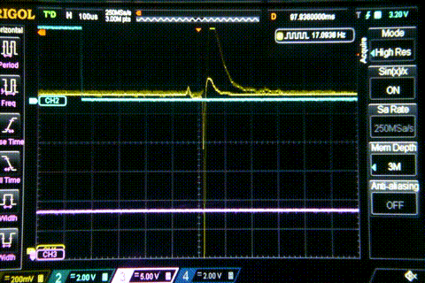

# Raspberry Pi RUN pin reset glitch

<figure>
    
    <figcaption>Raspberry Pi resetting when touching RUN</figcaption>
</figure>

&nbsp;

**ESD** was a problem (for another chapter maybe), so I started to do the tests using an ESD wrist wrap. 
Basically, the Y capacitor between primary DC+ and cold GND on the secondary side of a 5V (2-prong) power supply, is there to reduce the noise of HF switching, and thus meet EMI standards. 
It also provides a path for common mode 50hz or 60hz line noise, which is ~80Vrms @220v,50hz in this particular SMPSU, unless properly grounded.

&nbsp;

## Model

V is the voltage after the full-bridge rectifier with respect to mains earth, for a 50Hz mains (20ms period) 
The pulse signal controlling the closing of the path to ground has a period of 19ms, effectively creating a phase sweep. 

|  |  |
| ------ | ----- |
|  |  |

&nbsp;

## Simulator

Doing aggressive and repetitive resets was also risky so I designed a simulator, taking into account the open drain output of the XR77004, with the CMOS input of the BCM2837B

<table>
  <tr>
    <td>
      <figure><figcaption>Full-Wave MOSFET switch</figcaption><figure>
    </td>
    <td>
      <figure><figcaption>RUN pin simulator</figcaption><figure>
    </td>
  </tr>
  <tr>
    <td>
      <figure><figcaption>Phase Sweep: The reset occurs during the negative (AC coupling) half cycle.</figcaption><figure>
    </td>
    <td>
      <figure><figcaption>&nbsp;</figcaption><figure>
    </td>
  </tr>
</table>

&nbsp;

## Resetting the Raspberry Pi

<table>
  <tr>
    <td>
      <figure><figcaption>Using a differential probe with 40MΩ input impedance I can use the oscilloscope without grounding the Raspberry.</figcaption><figure>
    </td>
    <td>
      <figure><figcaption>Circuit used to reset the Raspberry using the Full-Wave MOSFET switch</figcaption><figure>
    </td>
  </tr>
</table>

The input to the microcontroller is a pulse of 20 ms period (AC mains). The rising edge activates an interrupt, that initiates the 2ms pulse in charge of closing the path to ground of the line noise present in the Raspberry. This pulse will have an increasing delay, performing a phase sweep from 0 to 180 degrees.

<table>
  <tr>
    <td>
      <figure><figcaption></figcaption><figure>
    </td>
    <td>
      <figure><figcaption></figcaption><figure>
    </td>
  </tr>
</table>

## Differential Probe Calibration:

- With open circuit, i.e. no path to ground:
  - Place the multimeter leads between R-Pi_GND and RUN, and use capture mode (peaks) on DC.
  - Take the min and max values: they should be, for example, between 3.170v and 3.434v
- With ground path present, using the MOSFET switch:
  - Do the same and capture min and max.
  - The values should be between 4.2v and 2.2v (2vpp)
- **DC coupling**:
  - Adjust the gain and differential compensation until both cases are achieved.
- **AC coupling**:
  - Set the control input at 5v. There should be no common mode voltage, so adjust the differential/common mode compensation so that you get a flat line.
  - Set the control at 0v. Adjust the gain until you get 2vpp
